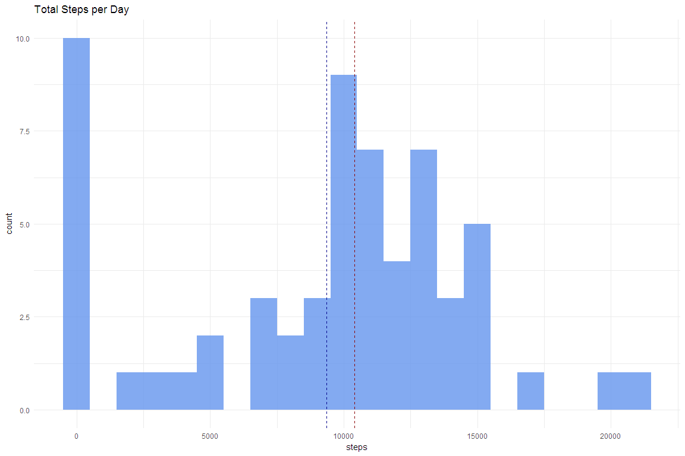
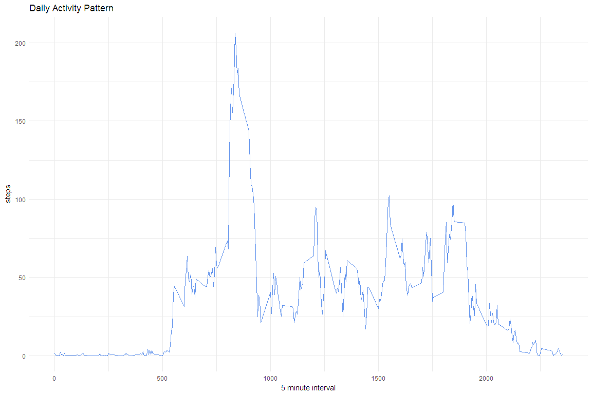
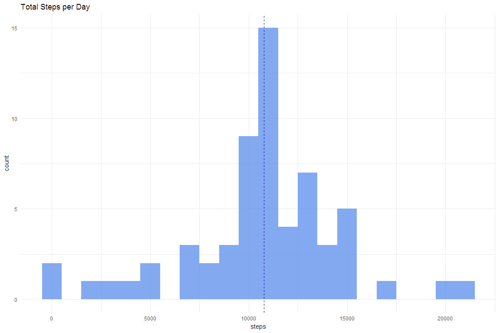
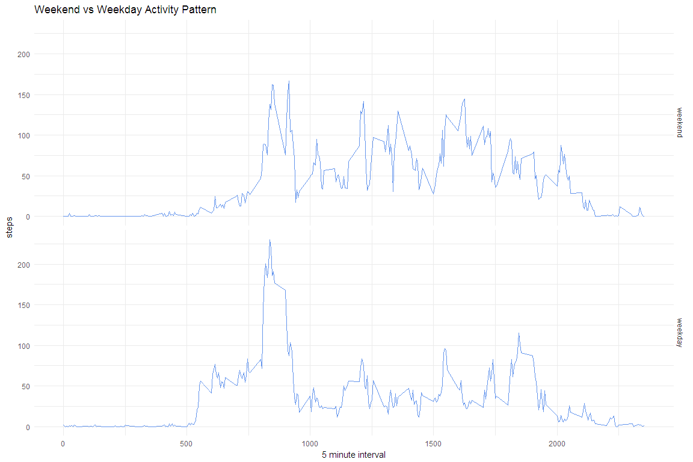

# Reproducible Research: Peer Assessment 1

```r
knitr::opts_chunk$set(echo = TRUE, 
                      message = FALSE,
                      warning = FALSE,
                      fig.width=12, 
                      fig.height=8)

library(readr)
library(dplyr)
```

```
## 
## Attaching package: 'dplyr'
```

```
## The following objects are masked from 'package:stats':
## 
##     filter, lag
```

```
## The following objects are masked from 'package:base':
## 
##     intersect, setdiff, setequal, union
```

```r
library(lubridate)
```

```
## 
## Attaching package: 'lubridate'
```

```
## The following object is masked from 'package:base':
## 
##     date
```

```r
library(ggplot2)
```


## Loading and preprocessing the data

```r
if(!file.exists("activity.csv")) {
    if(!file.exists("activity.zip")) {
        stop("Coudn't find activity.csv or activity.zip")
    } else {
        unzip(zipfile = "activity.zip")
    }
}

raw.activity.data <-
    read_csv("activity.csv")
```

## What is mean total number of steps taken per day?  

```r
daily.steps.na.rm <- 
    raw.activity.data %>% 
    group_by(date) %>%
    summarise(total.steps = sum(steps, 
                                na.rm = TRUE))
mean.steps <-
    daily.steps.na.rm$total.steps %>% 
    mean() %>%
    round(1)

median.steps <-
    daily.steps.na.rm$total.steps %>% 
    median()
```


```r
daily.steps.na.rm %>% 
    ggplot(aes(x = total.steps)) +
    geom_histogram(binwidth = 1000,
                   fill = "#6495ED",
                   alpha = 0.8) +
    geom_vline(aes(xintercept = mean.steps),
               linetype = 2,
               color = "#00008B") +
    geom_vline(aes(xintercept = median.steps),
               linetype = 2,
               color = "#8B0000") +
    labs(title = "Total Steps per Day",
         x = "steps",
         y = "count") +
    theme_minimal()
```

<!-- -->

If we ignore missing values we get:  
mean of total steps per day: 9354.2 *(blue dash line on plot)*  
median of total steps per day: 10395 *(red dash line on plot)*  

## What is the average daily activity pattern?


```r
activity.pattern <- 
    raw.activity.data %>% 
    group_by(interval) %>%
    summarise(average.steps = 
                  mean(steps,
                       na.rm = TRUE) %>% 
                  round(2))

activity.pattern %>% 
    ggplot(aes(x = interval,
               y = average.steps)) +
    geom_line(color = "#6495ED") +
    labs(title = "Daily Activity Pattern",
         x = "5 minute interval",
         y = "steps") +
    theme_minimal()
```

<!-- -->


```r
max.steps <-
    activity.pattern$average.steps %>% 
    max()

max.steps.interval <- 
         with(activity.pattern,
              interval[average.steps == max.steps])
```

In daily pattern we see 206.17 maximum of steps at 835 interval.

## Imputing missing values


```r
na.count <-
    raw.activity.data$steps %>% 
    is.na() %>% 
    sum()
```

There are 2304 missing values in original data.
We'll use mean values for coresponding 5 minutes intervals to fill them in.


```r
filled.activity.data <-
    raw.activity.data %>%
    inner_join(activity.pattern) %>%
    mutate(steps = 
               is.na(steps) %>%
               ifelse(average.steps,
                      steps)) %>% 
    select(-average.steps)
```


```r
filled.daily.steps <- 
    filled.activity.data %>% 
    group_by(date) %>%
    summarise(total.steps = sum(steps, 
                                na.rm = TRUE))
filled.mean.steps <-
    filled.daily.steps$total.steps %>% 
    mean() %>%
    round(1)

filled.median.steps <-
    filled.daily.steps$total.steps %>% 
    median() %>%
    round(1)
```


```r
filled.daily.steps %>% 
    ggplot(aes(x = total.steps)) +
    geom_histogram(binwidth = 1000,
                   fill = "#6495ED",
                   alpha = 0.8) +
    geom_vline(aes(xintercept = filled.mean.steps),
               linetype = 2,
               color = "#00008B") +
    geom_vline(aes(xintercept = filled.median.steps),
               linetype = 2,
               color = "#00008B") +
    labs(title = "Total Steps per Day",
         x = "steps",
         y = "count") +
    theme_minimal()
```

<!-- -->

If we fill in missing values with 5-minutes interval averages we get:  
mean of total steps per day: 10766.2
median of total steps per day: 10766.1
*(single blue dash line on plot as mean and median are very close)*  

## Are there differences in activity patterns between weekdays and weekends?

```r
weekday.activity.data <- 
    filled.activity.data %>% 
    mutate(day.of.week = 
               date %>%
               wday(),
           is.weekend =
               (day.of.week == 1 | day.of.week == 7) %>%
               ifelse("weekend",
                      "weekday") %>%
               factor(levels = c("weekend",
                                 "weekday"))) %>% 
    group_by(is.weekend, interval) %>% 
    summarise(average.steps = 
                  mean(steps))

weekday.activity.data %>% 
    ggplot(aes(x = interval, y = average.steps)) +
    facet_grid(is.weekend ~ .) +
    geom_line(color = "#6495ED") +
    labs(title = "Weekend vs Weekday Activity Pattern",
         x = "5 minute interval",
         y = "steps") +
    theme_minimal()
```

<!-- -->

